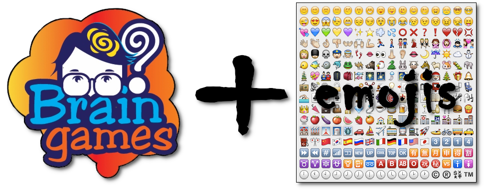

# Braingames usando emoticonos

Te propongo una serie de juegos temáticos muy didácticos y hechos con mucho amor con el que podrás ejercitar tu mente, más concretamente tu hemisferio cerebral izquierdo, y así prevenir el déficit cognitivo.

    ¡¡Dale al coco!! Que tanto meme, te lo está dejando frito. xD

Son muy simples. Se trata de *adivinar usando emoticonos* un conjunto de cosas con la misma temática.

Además que estarás practicando un poco de GitHub colaborativo. ;)

## ¿Te apuntas al reto?

Cualquier *PR (pull request)* es bienvenida para ampliar/corregir el repertorio de cada temática. También puedes contactar conmigo por [Twitter](http://twitter.com/davorpa) **[@davorpa](http://twitter.com/davorpa)** para tal propósito.

Las soluciones a cada propuesta están en un branch/rama aparte por temática.

## Temáticas

1. [Refranero español](./refranes/).

## Como jugar

Es muy simple:

1. Elije de entre esta lista tu temática abriendo el gist correspondiente creado para tal fin.
   1. Temática: [Refranero español](https://gist.github.com/davorpa/044a82bea0b399ebf9ed8cf1db2fe5f6).
2. Haz un comentario en dicho gist para la línea de código correspondiente indicando tu opción o lo que crees que es como respuesta.
3. Espera a que le dé el visto bueno.
